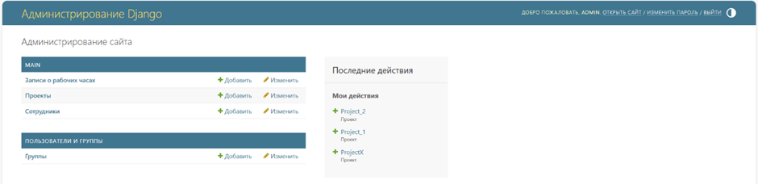

## Общее описание

Разработано приложение для автоматизации учета рабочих часов сотрудников (TimeSheet) с удобным интерфейсом для ввода, 
редактирования и анализа данных о рабочем времени с разграничением прав доступа

Использованные технологии, инструменты
 - ЯП Python, фреймворк Django, Django Rest Framework
 - Django ORM, Django Auth, DTL
 - Fetch API для AJAX-запросов
 - PostgreSQL
 - JS, HTML, CSS, Bootstrap

## Функциональные требования

1)	**TimeSheet** представляет собой таблицу с колонками 
 - Дата
 - Сотрудник
 - Проект
 - Кол-во часов, которое сотрудник по данному проекту отработал в указанный день
 - Комментарий (например, выполненные задачи)
 - Статус подтверждения менеджером
    - Pending (ожидает подтверждения) 
    - Approved (одобрен)
    - Rejected (отклонен)
 - Действия с данной записью в таблице 
   - Удалить
   - Изменить

2) **Сотрудник** имеет
 - Логин
 - Должность
   - Разработчик
   - Аналитик
   - Тестировщик
 - Статус
   - Активный
   - Неактивный (не может войти в систему)

     Удалить сотрудника может только Администратор. Удаление сотрудника является логическим. При удалении сотрудник
не удаляется из БД, а только меняет свой статус на Неактивный.  
    Чтобы сотрудник мог работать с системой, он должен зарегистрироваться. 
При регистрации ему нужно указать логин, пароль и свою должность. Его статус по умолчанию является активным, 
а роль – Обычный сотрудник. Роль может поменять только администратор

3)	В системе есть разные виды **прав** для пользователей
 - *Обычный сотрудник* имеет возможность 
   - зарегистрироваться в системе, указав логин, пароль и должность
   - просматривать, изменять, удалять свои записи о рабочих часах
   - использовать фильтрацию по дате для просмотра нужных записей
   - создавать новые записи с возможностью указать начальную и конечную даты для добавления стразу нескольких записей

 - Сотрудник с правами *Менеджера* (is_staff)
   - имеет все права обычного сотрудника
   - может просматривать, изменять, удалять записи о рабочих часах любого сотрудника
   - использовать фильтрацию по дате и по сотруднику для просмотра нужных записей
   - создавать новые записи для любого сотрудника
   - одобрять или отклонять созданные сотрудниками записи
   - выгрузить данные в xslx-файл

 - Сотрудник с правами *Администратора* (is_superuser) может совершать любые операции с данными из БД, используя 
панель администратора, он имеет максимальные права. Администратор (суперпользователь) создается при старте приложения и
может из панели администратора назначать права остальным пользователям.

4)	**Проект** имеет
 - Название
 - Заказчика
 - Статус
  - Активный
  - Приостановленный
  - Закрытый

     Создать, удалить проект и редактировать его данные может только Администратор.  
Удаление проекта является логическим. При удалении проект не удаляется из БД, а только меняет свой статус на Закрытый.

## Запуск

`py .\manage.py createsuperuser` - создание Администратора  
`py .\manage.py makemigrations` - создание миграций (выполнять при каждом изменении моделей)  
`py .\manage.py migrate` - применение миграций  
`py .\manage.py runserver` - запуск приложения (на http://localhost:8000)

Для запуска потребуется еще задать переменные окружения (например, в .env файле) такие как
 - DB_PASSWORD
 - DB_NAME
 - DB_USER
 - DB_HOST
 - DB_PORT

## Скрины

Регистрация

Работа с TimeSheet

Выход

Панель администратора

